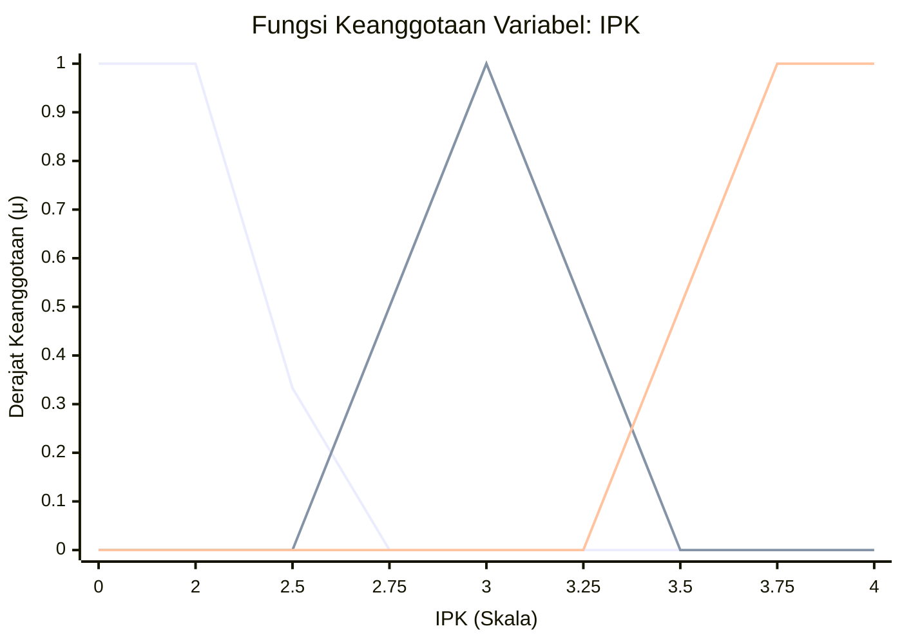
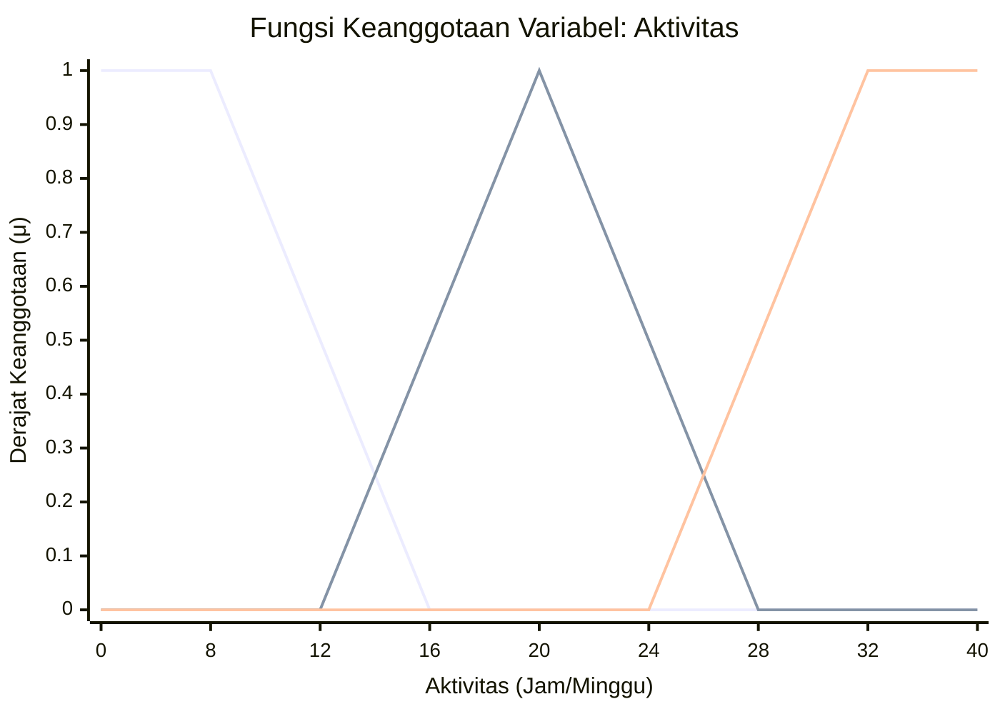
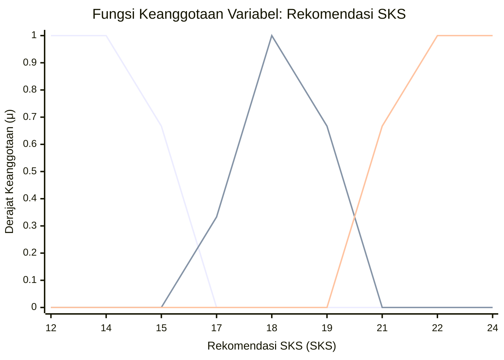

# LAPORAN ASESMEN MODUL 1
# PEMODELAN FUZZY

## 1. JUDUL PROYEK & IDENTITAS MAHASISWA

Proyek ini berjudul **"Sistem Rekomendasi Beban SKS Mahasiswa Berdasarkan IPK dan Aktivitas Non-Akademik"**. Pemodelan fuzzy digunakan untuk menentukan batas rekomendasi jumlah Kredit Semester (SKS) mahasiswa secara adaptif dan kontinyu tanpa menggunakan pembatasan kaku (*rigid threshold*).

| Komponen | Keterangan |
|---|---|
| Nama | Annisa Almaghvirah |
| NIM | 240306037 |
| Topik | Sistem Rekomendasi Beban SKS Mahasiswa |
| Input 1 | IPK (Indeks Prestasi Kumulatif, skala 0.00–4.00) |
| Input 2 | Aktivitas Non-Akademik (Jam/Minggu) |
| Output | Rekomendasi Beban SKS (SKS) |
| Label Input 1 | Rendah, Sedang, Tinggi |
| Label Input 2 | Lengang, Moderat, Padat |
| Label Output | Minimal, Sedang, Maksimal |
| Implementasi | Python / NumPy / Matplotlib |

---

## 2. LATAR BELAKANG & DESKRIPSI PERMASALAHAN

Penentuan beban studi (jumlah SKS) yang ideal bagi seorang mahasiswa berpengaruh signifikan terhadap keberhasilan akademiknya. Pada sistem informasi akademik konvensional, penentuan jatah SKS umumnya hanya didasarkan pada Indeks Prestasi Kumulatif (IPK) secara kaku (misalnya: IPK otomatis mendapatkan jatah 24 SKS).

Namun, pendekatan tersebut mengabaikan variabel riil lain seperti tingkat kesibukan atau Aktivitas Non-Akademik (organisasi, kerja paruh waktu, maupun kepanitiaan). Mahasiswa dengan IPK 3.80 yang memiliki tingkat aktivitas 35 jam/minggu berisiko mengalami burnout jika dipaksa mengambil 24 SKS, sedangkan pembatasan kaku sering kali tidak adil pada nilai perbatasan (contoh: IPK 2.99 vs 3.00).

Logika Fuzzy hadir untuk memetakan nilai konkret masukan ke dalam derajat keanggotaan (μ). Proyek Tahap 1 (Pemodelan Fuzzy) ini berfokus pada formulasi variabel linguistik, perancangan fungsi keanggotaan, pembuatan skrip Python murni, serta pengujian fuzzifikasi pada 5 skenario kondisi riil mahasiswa.

---

## 3. PERANCANGAN SISTEM FUZZY

### 3.1 Semesta Pembicaraan dan Domain Variabel

| Jenis Variabel | Nama Variabel | Satuan | Semesta Pembicaraan | Daftar Label Linguistik | Parameter Kurva |
|---|---|---|---|---|---|
| Input 1 | IPK | Skala | 0.00–4.00 | Rendah, Sedang, Tinggi | Rendah: (0.0, 0.0, 2.0, 2.75); Sedang: (2.5, 3.0, 3.5); Tinggi: (3.25, 3.75, 4.0, 4.0) |
| Input 2 | Aktivitas | Jam/Minggu | 0–40 | Lengang, Moderat, Padat | Lengang: (0, 0, 8, 16); Moderat: (12, 20, 28); Padat: (24, 32, 40, 40) |
| Output | Rekomendasi | SKS | 12–24 | Minimal, Sedang, Maksimal | Minimal: (12, 12, 14, 17); Sedang: (15, 18, 21); Maksimal: (19, 22, 24, 24) |

---

### 3.2 Penurunan Matematis Fungsi Keanggotaan

Fungsi keanggotaan dirancang menggunakan kombinasi kurva trapesium bahu kiri/kanan (trapmf) dan kurva segitiga (trimf).

#### A. Variabel IPK

Semesta pembicaraan: **0.00–4.00**

**1) Label Rendah — Trapesium Bahu Kiri**

Parameter: **(0.0, 0.0, 2.0, 2.75)**

Fungsi keanggotaan:

**μ Rendah (x) =**

⎧ 1,                         jika x ≤ 2.0
⎪ (2.75 − x) / (2.75 − 2.0), jika 2.0 < x < 2.75
⎩ 0,                         jika x ≥ 2.75

**2) Label Sedang — Segitiga**

Parameter: **(2.5, 3.0, 3.5)**

Fungsi keanggotaan:

**μ Sedang (x) =**

⎧ 0,                         jika x ≤ 2.5 atau x ≥ 3.5
⎪ (x − 2.5) / (3.0 − 2.5),   jika 2.5 < x ≤ 3.0
⎩ (3.5 − x) / (3.5 − 3.0),   jika 3.0 < x < 3.5

**3) Label Tinggi — Trapesium Bahu Kanan**

Parameter: **(3.25, 3.75, 4.0, 4.0)**

Fungsi keanggotaan:

**μ Tinggi (x) =**

⎧ 0,                         jika x ≤ 3.25
⎪ (x − 3.25) / (3.75 − 3.25), jika 3.25 < x < 3.75
⎩ 1,                         jika x ≥ 3.75

#### B. Variabel Aktivitas Non-Akademik

Semesta pembicaraan: **0–40 jam/minggu**

**1) Label Lengang — Trapesium Bahu Kiri**

Parameter: **(0, 0, 8, 16)**

Fungsi keanggotaan:

**μ Lengang (y) =**

⎧ 1,                 jika y ≤ 8
⎪ (16 − y) / (16 − 8), jika 8 < y < 16
⎩ 0,                 jika y ≥ 16

**2) Label Moderat — Segitiga**

Parameter: **(12, 20, 28)**

Fungsi keanggotaan:

**μ Moderat (y) =**

⎧ 0,                 jika y ≤ 12 atau y ≥ 28
⎪ (y − 12) / (20 − 12), jika 12 < y ≤ 20
⎩ (28 − y) / (28 − 20), jika 20 < y < 28

**3) Label Padat — Trapesium Bahu Kanan**

Parameter: **(24, 32, 40, 40)**

Fungsi keanggotaan:

**μ Padat (y) =**

⎧ 0,                 jika y ≤ 24
⎪ (y − 24) / (32 − 24), jika 24 < y < 32
⎩ 1,                 jika y ≥ 32

#### C. Variabel Rekomendasi SKS

Semesta pembicaraan: **12–24 SKS**

**1) Label Minimal — Trapesium Bahu Kiri**

Parameter: **(12, 12, 14, 17)**

Fungsi keanggotaan:

**μ Minimal (z) =**

⎧ 1,                 jika z ≤ 14
⎪ (17 − z) / (17 − 14), jika 14 < z < 17
⎩ 0,                 jika z ≥ 17

**2) Label Sedang — Segitiga**

Parameter: **(15, 18, 21)**

Fungsi keanggotaan:

**μ Sedang (z) =**

⎧ 0,                 jika z ≤ 15 atau z ≥ 21
⎪ (z − 15) / (18 − 15), jika 15 < z ≤ 18
⎩ (21 − z) / (21 − 18), jika 18 < z < 21

**3) Label Maksimal — Trapesium Bahu Kanan**

Parameter: **(19, 22, 24, 24)**

Fungsi keanggotaan:

**μ Maksimal (z) =**

⎧ 0,                 jika z ≤ 19
⎪ (z − 19) / (22 − 19), jika 19 < z < 22
⎩ 1,                 jika z ≥ 22

### 3.3 Ilustrasi Grafik Desain

Seluruh kurva bersebelahan saling bersinggungan (*overlap*) tanpa celah (*gap*).

- **Variabel IPK:** overlap Rendah–Sedang berada pada rentang **2.50–2.75**, dan Sedang–Tinggi pada rentang **3.25–3.50**.
- **Variabel Aktivitas:** overlap Lengang–Moderat berada pada rentang **12–16 jam/minggu**, dan Moderat–Padat pada rentang **24–28 jam/minggu**.
- **Variabel Rekomendasi SKS:** overlap Minimal–Sedang berada pada rentang **15–17 SKS**, dan Sedang–Maksimal pada rentang **19–21 SKS**.

#### Grafik IPK



Keterangan:
- **Rendah:** nilai 1 sampai IPK 2.0, kemudian turun sampai 0 pada IPK 2.75.
- **Sedang:** mulai dari IPK 2.5, mencapai nilai 1 pada IPK 3.0, lalu turun sampai 0 pada IPK 3.5.
- **Tinggi:** mulai naik dari IPK 3.25, mencapai nilai 1 pada IPK 3.75, dan tetap 1 sampai IPK 4.0.

#### Grafik Aktivitas Non-Akademik



#### Grafik Rekomendasi SKS



---

## 4. IMPLEMENTASI PYTHON

### 4.1 Source Code Lengkap

```python
import os
import matplotlib.pyplot as plt
import numpy as np

# ================================================================
# ASESMEN MODUL 1: PEMODELAN FUZZY
# Sistem Rekomendasi Beban SKS Mahasiswa
# Nama : Annisa Almaghvirah
# NIM  : 240306037
# ================================================================

def trimf(x, params):
    """Fungsi keanggotaan segitiga (a, b, c)."""
    a, b, c = params
    x = np.asarray(x, dtype=float)
    y = np.zeros_like(x)

    if b > a:
        idx1 = (x >= a) & (x <= b)
        y[idx1] = (x[idx1] - a) / (b - a)

    if c > b:
        idx2 = (x >= b) & (x <= c)
        y[idx2] = np.maximum(
            y[idx2],
            (c - x[idx2]) / (c - b)
        )

    y[x == b] = 1.0
    return np.clip(y, 0.0, 1.0)


def trapmf(x, params):
    """Fungsi keanggotaan trapesium (a, b, c, d)."""
    a, b, c, d = params
    x = np.asarray(x, dtype=float)
    y = np.zeros_like(x)

    if a == b:
        y[x <= c] = 1.0
    else:
        idx1 = (x >= a) & (x <= b)
        y[idx1] = (x[idx1] - a) / (b - a)

    y[(x >= b) & (x <= c)] = 1.0

    if c == d:
        y[x >= b] = 1.0
    else:
        idx2 = (x >= c) & (x <= d)
        y[idx2] = np.maximum(
            y[idx2],
            (d - x[idx2]) / (d - c)
        )

    return np.clip(y, 0.0, 1.0)


MODEL_FUZZY = {
    'IPK': {
        'unit': 'Skala',
        'semesta': (0.0, 4.0),
        'membership': {
            'Rendah': ('trapmf', (0.0, 0.0, 2.0, 2.75)),
            'Sedang': ('trimf', (2.5, 3.0, 3.5)),
            'Tinggi': ('trapmf', (3.25, 3.75, 4.0, 4.0)),
        },
    },

    'Aktivitas': {
        'unit': 'Jam/Minggu',
        'semesta': (0, 40),
        'membership': {
            'Lengang': ('trapmf', (0, 0, 8, 16)),
            'Moderat': ('trimf', (12, 20, 28)),
            'Padat': ('trapmf', (24, 32, 40, 40)),
        },
    },

    'Rekomendasi SKS': {
        'unit': 'SKS',
        'semesta': (12, 24),
        'membership': {
            'Minimal': ('trapmf', (12, 12, 14, 17)),
            'Sedang': ('trimf', (15, 18, 21)),
            'Maksimal': ('trapmf', (19, 22, 24, 24)),
        },
    },
}


def hitung_derajat(tipe_kurva, params, nilai):
    val_arr = np.array([float(nilai)])

    if tipe_kurva == 'trimf':
        return float(trimf(val_arr, params)[0])
    elif tipe_kurva == 'trapmf':
        return float(trapmf(val_arr, params)[0])

    return 0.0


def fuzzifikasi(input_dict):
    """Fungsi pemetaan nilai masukan konkret ke derajat keanggotaan."""
    hasil = {}

    for var_name, nilai in input_dict.items():
        if var_name in MODEL_FUZZY:
            hasil[var_name] = {}

            for label, (tipe_kurva, params) in MODEL_FUZZY[
                var_name
            ]['membership'].items():

                deg = hitung_derajat(
                    tipe_kurva,
                    params,
                    nilai
                )

                hasil[var_name][label] = round(deg, 4)

    return hasil


def plot_variabel(output_dir='.'):
    """Menyimpan dan MENAMPILKAN grafik fungsi keanggotaan."""
    os.makedirs(output_dir, exist_ok=True)

    for var_name, var_info in MODEL_FUZZY.items():
        x_min, x_max = var_info['semesta']
        x = np.linspace(x_min, x_max, 500)

        plt.figure(figsize=(8, 4), dpi=100)

        for label, (tipe_kurva, params) in var_info[
            'membership'
        ].items():

            if tipe_kurva == 'trimf':
                y = trimf(x, params)
            elif tipe_kurva == 'trapmf':
                y = trapmf(x, params)

            plt.plot(x, y, linewidth=2, label=label)

        plt.title(
            f'Fungsi Keanggotaan Variabel: {var_name}'
        )
        plt.xlabel(
            f"{var_name} ({var_info['unit']})"
        )
        plt.ylabel(
            'Derajat Keanggotaan (μ)'
        )
        plt.grid(
            True,
            linestyle='--',
            alpha=0.5
        )
        plt.legend()

        filename = os.path.join(
            output_dir,
            f"MF_{var_name.replace(' ', '_')}.png"
        )

        plt.savefig(
            filename,
            bbox_inches='tight'
        )

        plt.show()


if __name__ == '__main__':
    print(
        '=== MENAMPILKAN GRAFIK FUNGSI KEANGGOTAAN ==='
    )

    plot_variabel()

    print(
        '\n=== CONTOH PENGUJJIAN FUZZIFIKASI ==='
    )

    sampel_input = {
        'IPK': 3.40,
        'Aktivitas': 26.0
    }

    hasil_fuzzifikasi = fuzzifikasi(
        sampel_input
    )

    print(
        f'Input: {sampel_input}'
    )

    print(
        f'Hasil Fuzzifikasi: {hasil_fuzzifikasi}'
    )
```

### 4.2 Penjelasan Modul & Struktur Data

- **Modularitas Fungsi (`trimf` & `trapmf`)**: Menggunakan perhitungan array NumPy murni tanpa bergantung pada *black-box library fuzzy*.
- **Kamus `MODEL_FUZZY`**: Menampung struktur data semesta pembicaraan, satuan, jenis kurva, dan koordinat parameter secara rapi.
- **Fungsi `fuzzifikasi()`**: Fungsi utama yang menerima masukan numerik IPK dan Aktivitas, lalu menghasilkan dictionary derajat keanggotaan (μ).
- **Fungsi `plot_variabel()`**: Melakukan rendering visual grafik fungsi keanggotaan menggunakan Matplotlib dan memanggil `plt.show()` agar grafik langsung tampil di layar monitor/Jupyter Notebook.

---

## 5. HASIL PENGUJIAN & EVALUASI FUZZIFIKASI

### 5.1 Tabel Pengujian 5 Skenario

| No | Kasus Uji | Input 1 (IPK) | Input 2 (Aktivitas) | Derajat Keanggotaan Input 1 (IPK) | Derajat Keanggotaan Input 2 (Aktivitas) | Analisis Awal |
|---:|---|---:|---:|---|---|---|
| 1 | Ekstrem Bawah | 1.80 | 35.0 jam | Rendah: 1.0000; Sedang: 0.0000; Tinggi: 0.0000 | Lengang: 0.0000; Moderat: 0.0000; Padat: 1.0000 | IPK rendah dengan tingkat kesibukan sangat tinggi. |
| 2 | Transisi Bawah | 2.60 | 14.0 jam | Rendah: 0.2000; Sedang: 0.2000; Tinggi: 0.0000 | Lengang: 0.2500; Moderat: 0.2500; Padat: 0.0000 | Terjadi persinggungan Rendah–Sedang & Lengang–Moderat. |
| 3 | Kondisi Normal | 3.00 | 20.0 jam | Rendah: 0.0000; Sedang: 1.0000; Tinggi: 0.0000 | Lengang: 0.0000; Moderat: 1.0000; Padat: 0.0000 | Akademik dan kesibukan berada di kondisi ideal. |
| 4 | Transisi Atas | 3.40 | 26.0 jam | Rendah: 0.0000; Sedang: 0.2000; Tinggi: 0.3000 | Lengang: 0.0000; Moderat: 0.2500; Padat: 0.2500 | Terjadi persinggungan Sedang–Tinggi & Moderat–Padat. |
| 5 | Ekstrem Atas | 3.90 | 5.0 jam | Rendah: 0.0000; Sedang: 0.0000; Tinggi: 1.0000 | Lengang: 1.0000; Moderat: 0.0000; Padat: 0.0000 | Mahasiswa berprestasi tinggi dengan waktu luang sangat banyak. |

### 5.2 Interpretasi Hasil Derajat Keanggotaan

Derajat keanggotaan menunjukkan seberapa kuat suatu nilai termasuk ke dalam masing-masing kategori fuzzy. Nilai derajat keanggotaan berada pada rentang 0 sampai 1.

#### Skenario 1 — Extreme Lower

**Input:** IPK = 1.80 dan Aktivitas = 35 jam/minggu.

Untuk IPK 1.80, nilai berada pada daerah penuh kategori Rendah:

μ Rendah (1.80) = ⎧ 1, jika x ≤ 2.0

Karena 1.80 ≤ 2.0, maka:

**μ Rendah (1.80) = 1.0000**

Sedangkan kategori Sedang dan Tinggi bernilai 0 karena IPK 1.80 berada di bawah batas awal kedua kategori tersebut.

Untuk Aktivitas 35 jam/minggu:

μ Padat (35) = ⎧ 1, jika y ≥ 32

Karena 35 ≥ 32, maka:

**μ Padat (35) = 1.0000**

**Interpretasi:** Mahasiswa memiliki IPK rendah dan aktivitas non-akademik sangat padat.

#### Skenario 2 — Lower Transition

**Input:** IPK = 2.60 dan Aktivitas = 14 jam/minggu.

IPK 2.60 berada pada daerah peralihan antara Rendah dan Sedang.

**Kategori Rendah:**

μ Rendah (2.60) = ⎧ (2.75 − 2.60) / (2.75 − 2.0), jika 2.0 < x < 2.75

μ Rendah (2.60) = 0.15 / 0.75 = **0.2000**

**Kategori Sedang:**

μ Sedang (2.60) = ⎧ (2.60 − 2.5) / (3.0 − 2.5), jika 2.5 < x ≤ 3.0

μ Sedang (2.60) = 0.10 / 0.50 = **0.2000**

Untuk Aktivitas 14 jam/minggu:

**Kategori Lengang:**

μ Lengang (14) = ⎧ (16 − 14) / (16 − 8), jika 8 < y < 16

μ Lengang (14) = 2 / 8 = **0.2500**

**Kategori Moderat:**

μ Moderat (14) = ⎧ (14 − 12) / (20 − 12), jika 12 < y ≤ 20

μ Moderat (14) = 2 / 8 = **0.2500**

**Interpretasi:** Nilai IPK dan aktivitas berada pada daerah overlap. Artinya, IPK 2.60 memiliki keanggotaan yang sama sebesar 0.2000 pada kategori Rendah dan Sedang, sedangkan aktivitas 14 jam/minggu memiliki keanggotaan 0.2500 pada kategori Lengang dan Moderat.

#### Skenario 3 — Normal

**Input:** IPK = 3.00 dan Aktivitas = 20 jam/minggu.

Pada IPK 3.00, kategori Sedang berada pada titik puncak:

**μ Sedang (3.00) = 1.0000**

Kategori Rendah dan Tinggi bernilai 0.

Pada Aktivitas 20 jam/minggu, kategori Moderat berada pada titik puncak:

**μ Moderat (20) = 1.0000**

Kategori Lengang dan Padat bernilai 0.

**Interpretasi:** Mahasiswa berada pada kondisi sedang, baik dari sisi IPK maupun aktivitas non-akademik.

#### Skenario 4 — Upper Transition

**Input:** IPK = 3.40 dan Aktivitas = 26 jam/minggu.

IPK 3.40 berada pada daerah peralihan antara Sedang dan Tinggi.

**Kategori Sedang:**

μ Sedang (3.40) = ⎧ (3.50 − 3.40) / (3.50 − 3.0), jika 3.0 < x < 3.5

μ Sedang (3.40) = 0.10 / 0.50 = **0.2000**

**Kategori Tinggi:**

μ Tinggi (3.40) = ⎧ (3.40 − 3.25) / (3.75 − 3.25), jika 3.25 < x < 3.75

μ Tinggi (3.40) = 0.15 / 0.50 = **0.3000**

Untuk Aktivitas 26 jam/minggu:

**Kategori Moderat:**

μ Moderat (26) = ⎧ (28 − 26) / (28 − 20), jika 20 < y < 28

μ Moderat (26) = 2 / 8 = **0.2500**

**Kategori Padat:**

μ Padat (26) = ⎧ (26 − 24) / (32 − 24), jika 24 < y < 32

μ Padat (26) = 2 / 8 = **0.2500**

**Interpretasi:** IPK 3.40 lebih dekat ke kategori Tinggi karena derajat keanggotaannya 0.3000, sedangkan kategori Sedang sebesar 0.2000. Aktivitas 26 jam/minggu berada pada overlap Moderat dan Padat dengan nilai 0.2500.

#### Skenario 5 — Upper Extreme

**Input:** IPK = 3.90 dan Aktivitas = 5 jam/minggu.

Untuk IPK 3.90:

μ Tinggi (3.90) = ⎧ 1, jika x ≥ 3.75

Karena 3.90 ≥ 3.75, maka:

**μ Tinggi (3.90) = 1.0000**

Untuk Aktivitas 5 jam/minggu:

μ Lengang (5) = ⎧ 1, jika y ≤ 8

Karena 5 ≤ 8, maka:

**μ Lengang (5) = 1.0000**

**Interpretasi:** Mahasiswa memiliki IPK tinggi dan aktivitas non-akademik yang lengang.

#### Ringkasan Interpretasi

Hasil pengujian menunjukkan bahwa fungsi keanggotaan yang dirancang mampu memberikan nilai derajat keanggotaan sesuai posisi input pada masing-masing kategori. Pada nilai yang berada di tengah kategori, derajat keanggotaan dapat mencapai 1.0000. Pada daerah overlap, satu input dapat memiliki derajat keanggotaan pada dua kategori sekaligus. Hal ini menunjukkan bahwa model fuzzy tidak memberikan batas yang kaku, tetapi mampu menggambarkan kondisi peralihan secara bertahap.

## 6. KESIMPULAN & RENCANA PENGEMBANGAN MODUL 2

### a. Kesimpulan

Pemodelan Fuzzy Sistem Rekomendasi Beban SKS berhasil dibangun dengan 2 input (IPK & Aktivitas) serta 1 output (Rekomendasi SKS).

- Perancangan Kurva Keanggotaan memenuhi kriteria teknis dengan *overlapping* tanpa *gap*.
- Implementasi Fungsi Python murni sukses melakukan fuzzifikasi pada 5 skenario sampel secara presisi dan mampu menampilkan grafik secara otomatis.

### b. Rencana Pengembangan Modul 2

- Menyusun 9 basis aturan (*rule base*) berlogika AND yang menghubungkan kombinasi IPK dan Aktivitas ke variabel Rekomendasi SKS.
- Mengimplementasikan mesin inferensi Mamdani (Min-Max Aggregation).
- Menerapkan perhitungan defuzzifikasi (Centroid) untuk menghasilkan rekomendasi tegas jumlah SKS.
